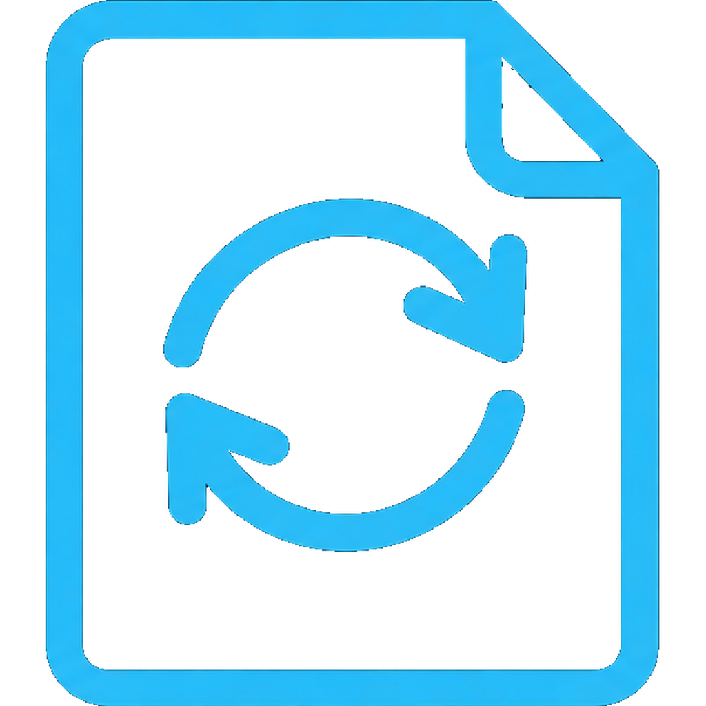
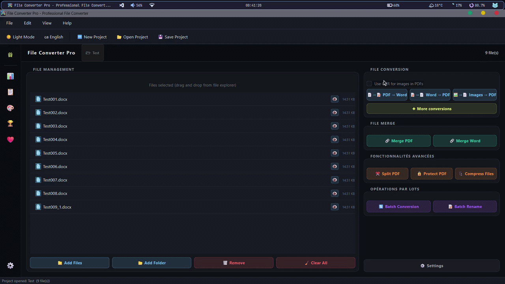

<h1>File Converter Pro</h1>

<em>A free, offline, all-in-one file converter for Windows built to feel premium.</em>

 

> 

 

**[Download](../../releases)**

---

## What is File Converter Pro?

File Converter Pro is a **free, fully offline Windows desktop application** that converts documents, images, audio, and video, all from one polished tool, without a browser or uploading your files anywhere.

Built with Python and PySide6. Animated startup, system-aware dark/light theme, statistics dashboard, gamified achievements, multi-language support. Lightweight: ~225 MB when installed from the installer and ~219 MB when installed as a portable file.

Core philosophy: **ship nothing until it runs perfectly on a clean machine, with zero preinstalled dependencies.**

---

## Highlights

- **All-in-one**: documents, images, audio, video, batch supported
- **100% offline & private**: no telemetry, no uploads, no internet required
- **Statistics & achievements**: animated dashboard and SQLite-backed gamification
- **Automation**: watch folders and scheduled tasks, runs as a background daemon
- **Windows context menu**: right-click any supported file → Convert with FCP
- **Community i18n**: drop a `.lang` JSON file to add a language, no code needed

---

## Download

| | Link |
|---|---|
| **Installer** *(recommended)* | [Latest Release](../../releases/latest) → `FileConverterPro_x64.7z` |

Windows 10 / 11 (64-bit). No Python, no dependencies. Just run the installer.

---

## License

Dual licensed: **GPLv3** for open-source use · **Commercial License** for proprietary products.
See [`LICENSE`](LICENSE.md).

© 2026 Prime Enterprises. All rights reserved.

---

Built by Prime Enterprises <em>because file conversion should actually feel good.</em>

